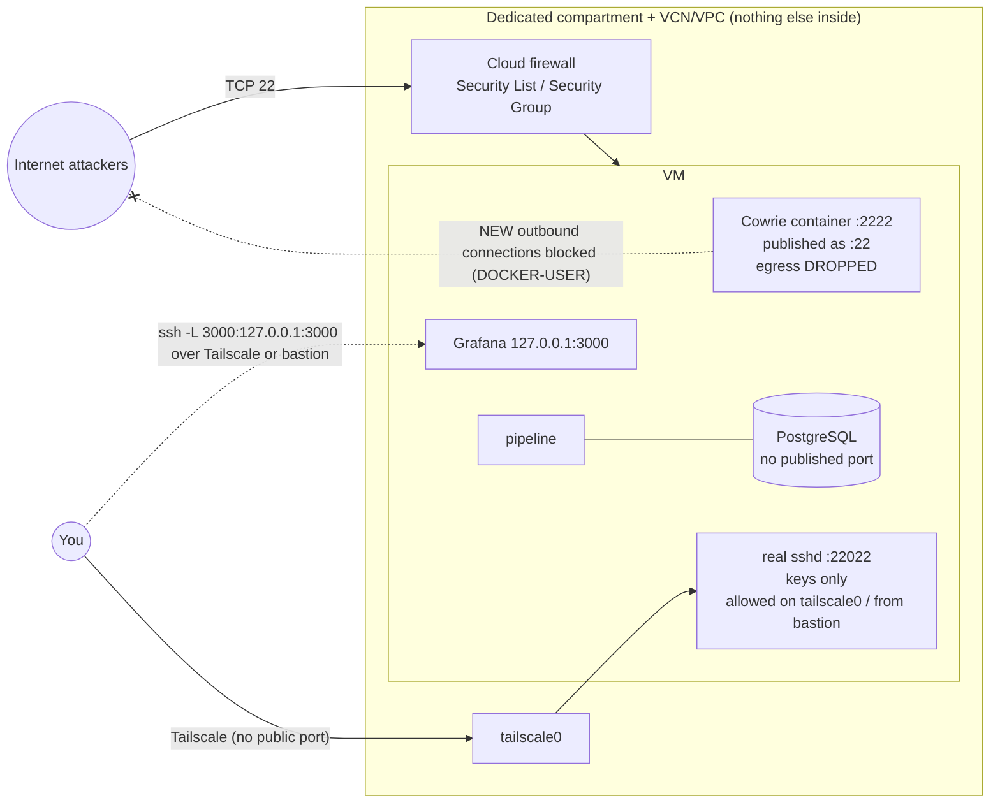

# Deploy HoneyLens to the cloud (real attackers)

> **Status: not yet run on a real cloud VM.** In the current workspace audit, Docker and ShellCheck
> were unavailable, so the merged Compose configuration, port checker, and firewall scripts could
> not be rerun. Treat the deployment steps as **UNVERIFIED** until those checks pass in a suitable
> environment.
> Free-tier facts below were read from the official Oracle and AWS pages on **7 October 2026**;
> providers change them, so re-check before you sign up.

**Goal:** a small VM that exposes ONLY the fake SSH server to the internet, with everything else
closed to the public Internet, isolated in its own account area, with a budget alarm, backups and
an easy teardown.

**Admin access, in order of preference** (details in step 7):

| Option | Public ingress for admin SSH? | Label |
|---|---|---|
| **A. Tailscale** (private WireGuard network) | **none** - sshd is reachable only on the `tailscale0` interface | preferred |
| **B. Cloud bastion**: OCI Bastion port-forwarding session / AWS EC2 Instance Connect Endpoint | **none** from the Internet - only from the bastion/endpoint inside the VCN/VPC | preferred if you do not want extra software on the VM |
| C. Source-IP-restricted SSH on TCP 22022 | **yes** - a public ingress rule limited to your IP/32 | **fallback only**; this is NOT private SSH |

Option C is still a public listener: anyone who shares or spoofs your source IP path (same
carrier-grade NAT, café Wi-Fi, a changed home IP) can reach it. It is kept because it is simple and
works when Tailscale or the bastion is unavailable, and as the lockout-recovery path.



## Before you start: the rules

1. Use a **dedicated** cloud account/compartment/VPC with nothing else in it. A honeypot is a
   magnet for attacks; never put it next to real systems or real data.
2. Only Cowrie is public. Admin SSH moves off port 22 to port 22022 and is reached over Tailscale or a
   cloud bastion with **no public ingress rule**. A public rule for 22022 from your IP is a labelled
   fallback (step 7, option C), never the default.
3. Grafana and PostgreSQL are never public. Grafana is reached through an SSH tunnel.
4. Cowrie cannot make outbound connections (host firewall), so it can never be used to attack others.
5. Check your provider's acceptable-use policy. Running a honeypot is normally allowed;
   attacking back is not, and HoneyLens never does it.

## Option A (recommended): Oracle Cloud Infrastructure (OCI) Always Free

### 0. What "Always Free" gives you today (official docs, checked 7 Oct 2026)

Source: [OCI Always Free Resources](https://docs.oracle.com/en-us/iaas/Content/FreeTier/freetier_topic-Always_Free_Resources.htm)
and the [Oracle Cloud Free Tier FAQ](https://www.oracle.com/cloud/free/faq/).

| Resource | Always Free amount | What HoneyLens uses |
|---|---|---|
| Ampere A1 (Arm) compute, `VM.Standard.A1.Flex` | first **1,500 OCPU-hours and 9,000 GB-hours per month** = **2 OCPUs and 12 GB RAM** in total, split over 1-2 VMs, **home region only** | 1 VM, 1 OCPU / 6 GB (leaves room) |
| AMD micro VMs, `VM.Standard.E2.1.Micro` | up to 2 (1/8 OCPU, 1 GB RAM each) | not used (too small for PostgreSQL + Grafana) |
| Block volume | 200 GB total (boot + block), 5 backups; boot volume min ~47-50 GB | one 50 GB boot volume |
| Outbound data | 10 TB / month | far below |
| Monitoring / Notifications | 500 M ingestion datapoints; 1,000 email notifications / month | CPU alarm + budget e-mails |

> Older guides (and an earlier version of this file) say "4 OCPUs and 24 GB". The current official
> page says **2 OCPUs and 12 GB** for Always Free tenancies. Trust the official page.

**Idle-instance reclamation (important for a honeypot).** Oracle may reclaim (stop) an Always Free
VM if, over **7 days**, ALL of these are true: 95th-percentile **CPU < 20%**, **network < 20%**, and
(A1 shapes only) **memory < 20%**. Separately, an *account* left idle for 30+ days may be treated as
abandoned.

What this means for HoneyLens: a honeypot is mostly idle. With 1 OCPU / 6 GB the stack uses roughly
1-2 GB RAM and little CPU, so the VM **can look idle and may be reclaimed**. Plan for it:

* keep regular **backups off the VM** (step 12) so a reclaimed VM costs you nothing but time;
* log in to the console at least every couple of weeks (avoids "abandoned account");
* if you need the VM to stay up for a long study, upgrading the account to **Pay As You Go** removes
  the reclamation risk while Always Free resources stay free - only do this with the budget alert
  from step 3 in place;
* do **not** run fake CPU burners to dodge the rule - it wastes shared capacity and may break the terms.

**"Out of host capacity".** Free Ampere capacity is often sold out. Oracle's advice: try another
availability domain, wait (it can take days) and retry, or upgrade to Pay As You Go. Do not script
hundreds of retries per minute.

**Card verification.** Sign-up needs a credit card or a debit card that works like a credit card
(no prepaid, virtual or PIN-only debit cards). Oracle may place a temporary authorisation hold that
your bank removes in a few days; Always Free use is not charged. One free account per person.

### 1. Region
Choose your **home region** carefully; Always Free resources live only there and it cannot be
changed later. From India, *India West (Mumbai)* or *India South (Hyderabad)* gives the lowest
latency. If Ampere capacity is "out of host capacity", try again later or another availability domain.

### 2. Account and MFA (Multi-Factor Authentication)
Sign up at cloud.oracle.com (card verification, see step 0). Then enable **MFA** for your console
user with an authenticator app (Profile → Security / "Multi-factor authentication"; on newer
tenancies MFA is enforced by the Identity Domain sign-on policy). Do not use the tenancy
administrator day to day: create your own user in a `honeypot-admins` group whose policy only
allows managing the `honeylens` compartment (step 4).

### 3. Budget alert
Billing & Cost Management → **Budgets** → Create budget: target = your account (or the
compartment from step 4), amount = **1** (your currency), alert at **1%** actual spend, email to you.
Always Free should cost 0; this alerts you if something paid is created by mistake.

### 4. Dedicated compartment
Identity → Compartments → Create `honeylens` (description "isolated honeypot - nothing else here").
Create EVERYTHING below inside it, including its own VCN (step 5). Teardown later = delete this
compartment's resources. Optional: a compartment **quota** that allows only A1 compute.

**No instance principal / workload identity.** Do NOT create a *dynamic group* that matches this VM
and do NOT write IAM policies for it. Do not put an OCI CLI config, API key or auth token on the VM.
If an attacker ever escaped Cowrie, the VM must hold **no cloud credentials** - it should not be able
to call any OCI API. (The egress rule installed in step 9 also stops Cowrie from reaching the instance
metadata service at `169.254.169.254`.)

**No personal secrets on the honeypot.** No personal SSH private keys, no GitHub tokens, no
password manager, no browser sessions, no copies of other projects. The only secrets on the VM are
the random HoneyLens database/Grafana passwords created by `scripts/make_env.py`.

### 5. Network (VCN = Virtual Cloud Network)
Networking → Virtual Cloud Networks → **Start VCN Wizard** → "VCN with Internet Connectivity",
compartment `honeylens`, name `honeylens-vcn`. Then edit the **public subnet's Security List**:

| Direction | Source | Protocol / port | Why |
|---|---|---|---|
| Ingress | `0.0.0.0/0` | TCP 22 | Cowrie (attackers) |
| Ingress | `<YOUR.PUBLIC.IP>/32` | TCP 22 | TEMPORARY: initial admin login before step 7 - delete afterwards |
| Ingress (option B only) | the VCN CIDR (bastion private IP) | TCP 22022 | OCI Bastion port-forwarding session |
| Ingress (**fallback C only**) | `<YOUR.PUBLIC.IP>/32` | TCP 22022 | source-IP-restricted public admin SSH - add only if A/B fail |
| Egress | `0.0.0.0/0` | all | needed for apt/docker pulls; Cowrie itself is blocked by the host rules applied in step 9 |

Delete any other default ingress rules (for example ICMP from everywhere is fine to keep or remove).
Find your public IP by searching "what is my ip" (it can change on mobile/home networks).

### 6. VM
Compute → Instances → Create: image **Canonical Ubuntu 24.04**, shape **VM.Standard.A1.Flex**
(Ampere ARM) with **1 OCPU and 6 GB RAM** (inside the free allowance), boot volume 50 GB, public
subnet of `honeylens-vcn`, assign a public IPv4, upload YOUR SSH public key. Note the public IP.

```bash
ssh ubuntu@<VM_IP>      # still on port 22 at this point
sudo apt update && sudo apt -y full-upgrade && sudo reboot
```

Oracle's Ubuntu images also have a host firewall (iptables). The admin-port rule depends on the
access option you pick in step 7, so it is added there.

### 7. Move admin SSH off port 22

```bash
git clone https://github.com/<you>/honeylens.git && cd honeylens     # or scp the ZIP
sudo sh deploy/move-admin-ssh.sh 22022
```

Then choose ONE way to reach port 22022. `<ADMIN_HOST>` in the rest of this guide means the
Tailscale name/IP (option A), `localhost -p <local port>` through the bastion (option B), or the
VM public IP (fallback C).

**Option A (preferred): Tailscale.** Free Personal plan (checked on tailscale.com/pricing, 7 Oct 2026).
```bash
curl -fsSL https://tailscale.com/install.sh -o ts-install.sh   # official script; read it first
sudo sh ts-install.sh && sudo tailscale up                     # approve the device in your browser
tailscale ip -4                                                # e.g. 100.x.y.z = <ADMIN_HOST>
sudo iptables -I INPUT 5 -i tailscale0 -p tcp --dport 22022 -m conntrack --ctstate NEW -j ACCEPT
sudo apt -y install iptables-persistent && sudo netfilter-persistent save
```
In the Tailscale admin console, tag the VM (e.g. `tag:honeypot`) and write an access-control rule
that lets **your user reach `tag:honeypot:22022`** and gives `tag:honeypot` **no** access to any other
device. A honeypot must be treated as possibly compromised; it must not be able to reach your laptop.
No cloud ingress rule for 22022 is needed. Tailscale only needs outbound traffic from the VM host
(Cowrie's container is still blocked by the host rules applied in step 9).

**Option B: cloud bastion (no software on the VM).**
* OCI: Identity & Security → Bastion → create a bastion in `honeylens-vcn`, then an **SSH port
  forwarding session** to the VM's private IP, port 22022 (this session type needs no Oracle Cloud
  Agent). Add the security-list row "VCN CIDR → TCP 22022" from step 5 and
  `sudo iptables -I INPUT 5 -s <VCN_CIDR> -p tcp --dport 22022 -m conntrack --ctstate NEW -j ACCEPT`.
  Sessions expire (maximum time-to-live 3 hours), which is a feature.
* AWS: an **EC2 Instance Connect Endpoint** in the VPC (no extra cost; access controlled by IAM and
  logged in CloudTrail; connections last at most 1 hour). Security group: TCP 22022 from the
  endpoint's security group only. Connect with
  `aws ec2-instance-connect open-tunnel --instance-id <id> --remote-port 22022 --local-port 2222`.
  AWS Systems Manager Session Manager is **not** recommended here: it needs an IAM instance profile,
  and this guide deliberately gives the honeypot no cloud credentials.

**Fallback C: source-IP-restricted public SSH** (use only if A and B are not possible). Add the
"fallback C" row from step 5 and `sudo iptables -I INPUT 5 -p tcp --dport 22022 -m conntrack --ctstate NEW -j ACCEPT`.
This is a **public** ingress rule restricted by source IP, not private access. Remove it again once
A or B works.

**Keep this session open.** In a NEW terminal: `ssh -p 22022 ubuntu@<ADMIN_HOST>` (via your chosen
option). Only when that works, delete the temporary "TCP 22 from your IP" rule (step 5). From now on
port 22 belongs to Cowrie.

**Lockout recovery** (if no option works): OCI Console → Instance → **Console connection** (serial
console) or AWS **EC2 Serial Console**; log in with a local password you set beforehand
(`sudo passwd ubuntu`), then fix `/etc/ssh/sshd_config.d/10-honeylens-admin.conf` or the iptables
rule. As a last resort, temporarily re-add "TCP 22022 from your IP/32" (fallback C) - Cowrie keeps
port 22, so the real sshd is only ever on 22022.

### 8. Docker

```bash
curl -fsSL https://get.docker.com -o get-docker.sh   # official script; read it first
sudo sh get-docker.sh
sudo usermod -aG docker ubuntu && exit               # log in again: ssh -p 22022 ubuntu@<ADMIN_HOST>
docker compose version                               # must be v2.x
```

### 9. Apply egress lockdown before starting Cowrie

```bash
cd honeylens
python3 scripts/make_env.py
python3 scripts/check_ports.py -f docker-compose.yml -f docker-compose.cloud.yml --cloud   # must PASS
sudo sh deploy/egress-lockdown.sh
sudo netfilter-persistent save
docker compose -f docker-compose.yml -f docker-compose.cloud.yml up -d --build
docker compose ps        # all healthy; cowrie shows 0.0.0.0:22->2222/tcp
```

This ordering installs the host firewall rules before Cowrie is exposed on port 22. The Docker
daemon must already be running so its `DOCKER-USER` chain exists. Optional GeoIP for real attackers:
`sh scripts/download_geoip.sh && docker compose restart pipeline`.

### 10. Verify the egress lockdown

```bash
sudo sh deploy/verify-egress.sh      # must print PASS
```

`verify-egress.sh` sends **no traffic to the Internet or to any third-party service**. It starts two
throwaway listeners that you control on the VM (one in a temporary network namespace addressed from
the RFC 2544 test range 198.18.0.0/15, which the host routes and NATs exactly like Internet traffic,
and one on the Cowrie bridge gateway), tries to connect to them from inside Cowrie, and passes only
if both attempts fail **and** the packet counters of the HoneyLens DROP rules went up - proving our
rule did the blocking. The rules: `DOCKER-USER` drops every NEW
connection from the Cowrie subnet (Internet, other containers, cloud metadata) and an `INPUT` rule
drops NEW connections from the Cowrie bridge to the VM itself.

Cowrie's own config also binds outbound connections to loopback (defence in depth).

### 11. Grafana through an SSH tunnel

On YOUR laptop:

```bash
ssh -p 22022 -N -L 3000:127.0.0.1:3000 ubuntu@<ADMIN_HOST>     # over Tailscale / bastion
```

Then open <http://127.0.0.1:3000>. Port 3000 is never open in the cloud firewall.

### 12. Backups

```bash
sh deploy/backup.sh                                 # backups/honeylens-YYYYmmdd-HHMMSS.sql.gz, keeps 7
crontab -e   # add:  15 3 * * * cd /home/ubuntu/honeylens && sh deploy/backup.sh >> backup.log 2>&1
```

Copy backups off the VM occasionally: `scp -P 22022 ubuntu@<ADMIN_HOST>:honeylens/backups/*.gz .`
Backups contain attacker data only (no real secrets), but keep them private anyway.

### 13. Retention and disk limits

* `HL_RETENTION_DAYS` (default 60 in the cloud override) deletes old rows daily.
* Docker logs are capped (10 MB x 3 per container) in the compose file.
* `deploy/disk-guard.sh` (cron every 30 min) warns at 85% and applies 30-day retention.
* Cowrie TTY recordings and SFTP uploads are disabled, so attacker files do not pile up.

### 14. Monitoring

* Grafana **Pipeline Health** dashboard: "Seconds since last heartbeat" should stay under 90.
* `docker compose ps` - all healthy; `docker compose logs --since 1h pipeline | grep -i error`.
* OCI Console → Instance → Metrics (CPU, memory, network). Create an Alarm on CPU > 80% for 15 min.
* Expect your first real attacks within minutes; port 22 is scanned constantly.

### 15. Teardown (do this when you finish the project)

```bash
sh deploy/backup.sh && scp -P 22022 ubuntu@<ADMIN_HOST>:honeylens/backups/*.gz .   # keep a copy
docker compose -f docker-compose.yml -f docker-compose.cloud.yml down -v
```

Then in the console: terminate the instance (**delete the boot volume** too), delete the VCN,
delete the budget, delete the `honeylens` compartment. Check Billing → Cost Analysis shows 0.

## Option B: AWS Free Tier alternative

**Current Free Tier caveats (official [AWS Free Tier FAQ](https://aws.amazon.com/free/free-tier-faqs/), checked 7 Oct 2026):**

* New accounts get **up to US$200 in credits** ($100 at sign-up + up to $100 for activities) on the
  **Free plan**, which lasts **at most 6 months** or until the credits are used up.
* When the Free plan ends, AWS **suspends the account** and keeps data for 90 days; after that the
  account and its content are erased unless you upgrade to the Paid plan. Back up first.
* Credits are spent by EC2 hours, EBS storage **and the public IPv4 address charge**, so a 24/7
  honeypot slowly uses up credits. Watch the Cost and Usage widget.
* Only new customers qualify; the old "12 months free t2.micro" offer is not what new accounts get.
  Check in the console which instance types are marked "Free Tier eligible" for your account.

**Isolation recommendations:**

1. **Dedicated account.** Use a separate AWS account used ONLY for the honeypot. AWS currently
   says joining an account to AWS Organizations ends its Free plan and moves it to the Paid plan;
   use a standalone new account if you rely on Free plan credits. Never use your main/personal account.
2. **Dedicated VPC.** Its own VPC + one public subnet, no peering, no VPN, no Transit Gateway,
   no other instances.
3. **Dedicated security boundary.** Root user with MFA and then locked away; a separate IAM
   Identity Center/IAM user with MFA for daily work; the EC2 instance gets **no IAM instance
   profile/role**; require **IMDSv2** with hop limit 1 so containers cannot read instance metadata;
   if you use Organizations, a Service Control Policy that denies everything except EC2/VPC/budgets
   in that account is a strong extra guard.
4. **Budget:** Billing → Budgets → "Zero spend budget" (or US$1) e-mail alert.

| OCI step | AWS equivalent |
|---|---|
| Region | e.g. `ap-south-1` (Mumbai) |
| Account + MFA | root user MFA + an IAM Identity Center or IAM user for daily use |
| Budget alert | Billing → Budgets → "Zero spend budget" template |
| Compartment | a separate AWS account in AWS Organizations is the cleanest isolation; at minimum a dedicated VPC + tag `Project=honeylens` |
| VCN + Security List | VPC + **Security Group**: inbound TCP 22 from 0.0.0.0/0 (Cowrie); TCP 22022 only from the EC2 Instance Connect Endpoint security group (option B) or nothing (Tailscale, option A); "TCP 22022 from your IP/32" only as fallback C; no other inbound |
| VM | EC2 `t3.micro` or `t4g.micro` (ARM, Graviton) if eligible in your account's free plan, Ubuntu 24.04, 20-30 GB gp3. 1 GB RAM is tight: set `HL_BATCH_SIZE=200` and keep Grafana stopped when not in use (`docker compose stop grafana`) |
| Host firewall | Ubuntu on EC2 has no iptables INPUT rules by default; the Security Group does the filtering |
| Steps 7-15 | identical (move SSH, Docker, cloud compose, egress lockdown, tunnel, backups, retention, monitoring with CloudWatch, teardown: terminate instance + delete volume, VPC, budget) |

Free-tier terms change over time - check the current AWS Free Tier page before creating anything.
Option B has not been tested on AWS yet.

## Checklist after deploying

Run them on a fresh account, then record: `check_ports --cloud` output, the
`verify-egress.sh` PASS output from step 10, an `nmap -Pn -p 22,3000,5432,22022 <VM_PUBLIC_IP>` from
outside Tailscale showing only 22 open (22022 filtered unless you use fallback C), and the first REAL
sessions on the dashboards.
