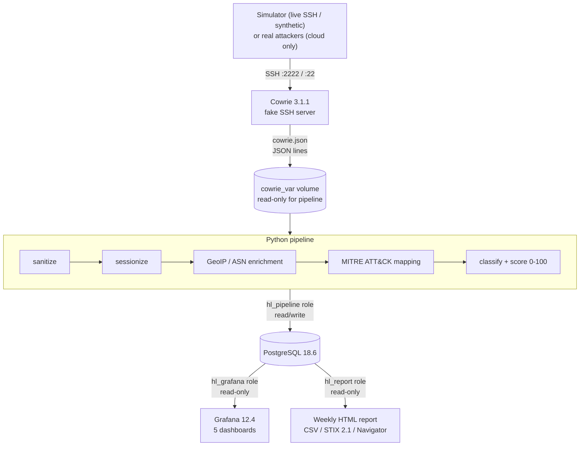

# HoneyLens

**An SSH honeypot and threat-intelligence pipeline you can run on a laptop with 3 commands.**

HoneyLens runs [Cowrie](https://github.com/cowrie/cowrie) (a fake SSH server) and reads every attacker
event. It cleans each event, adds location and network information, maps attacker commands to
**MITRE ATT&CK**, scores each session, and stores everything in **PostgreSQL**. You get five
**Grafana** dashboards plus a weekly HTML report with IOC (Indicator of Compromise) exports in CSV,
STIX 2.1 and ATT&CK Navigator formats.


> All dashboard data in the screenshots comes from the built-in simulator, not real attackers.

---

## How to use this repo

### 1. Prerequisites

| Tool | Windows | macOS | Linux |
|---|---|---|---|
| Docker | Docker Desktop (WSL 2 backend) | Docker Desktop | Docker Engine + Compose v2 |
| Python 3.11+ | python.org installer (tick "Add to PATH") | `brew install python` | your package manager |
| Git | git-scm.com | `brew install git` | your package manager |

Check that `docker compose version` prints v2.x. You'll need about 2 GB of free RAM.

### 2. Clone and configure

```bash
git clone https://github.com/VRCHAMPION/honeylens.git
cd honeylens
python scripts/make_env.py          # creates .env with random passwords (git-ignored)
```

### 3. Start the stack

```bash
docker compose up -d --build
docker compose ps                   # wait until postgres, cowrie, pipeline, grafana show (healthy)
python scripts/check_ports.py --live
```

The `migrate` service runs once, creates the database, then exits with code 0. That is expected.

### 4. Generate safe attack data

```bash
docker compose --profile sim run --rm simulator     # 16 real SSH sessions from 8 attacker personas
docker compose --profile sim run --rm synthetic     # 14 days of synthetic events
```

### 5. Open the dashboards

Go to **http://127.0.0.1:3000** and log in as `admin`, using `GF_ADMIN_PASSWORD` from `.env` as
the password. Open **Dashboards**, then the **HoneyLens** folder.

### 6. Attack it yourself

```bash
ssh -p 2222 root@127.0.0.1          # password: admin123
```

Try `uname -a`, `cat /etc/passwd` or `wget http://example.invalid/x`. Your commands appear in
**Session Explorer** within seconds.

### 7. Generate the weekly report

```bash
docker compose --profile tools run --rm report
```

Then open `out/weekly-report.html`. To mask IPs before sharing, run
`docker compose --profile tools run --rm report honeylens-report --out /out --mask-ips`.

### 8. Run the tests

```bash
python -m venv .venv
source .venv/bin/activate           # Windows: .venv\Scripts\activate
pip install -e ".[dev]"
pytest
```

### 9. Stop

```bash
docker compose stop                 # stop, keep data
docker compose down -v              # remove everything, including the database
```

Step-by-step guide with troubleshooting: [RUN_ON_LAPTOP.md](RUN_ON_LAPTOP.md).
To put the honeypot on the internet and catch real attackers: [DEPLOY_CLOUD.md](DEPLOY_CLOUD.md).

---

## Architecture



More diagrams: [docs/ARCHITECTURE.md](docs/ARCHITECTURE.md).

## Features

| Part | What it does | Where |
|---|---|---|
| Cowrie honeypot | fake Debian 12 server, JSON logs, Telnet off, no forwarding, downloads blocked | `cowrie/` |
| Pipeline | tails logs with crash-safe offsets, handles rotation, deduplicates, batches | `src/honeylens/pipeline/` |
| Enrichment | deterministic demo data, optional offline MMDB GeoIP/ASN, database cache, optional rate-limited IPInfo API | `src/honeylens/enrich/` |
| ATT&CK mapping | 60 YAML regex rules across 9 tactics and 45 techniques (ATT&CK v19.2) | `src/honeylens/mitre/` |
| Scoring | explainable 0-100 severity, behaviour classes, bot vs human | `src/honeylens/pipeline/scoring.py` |
| Simulator | 8 safe attacker personas, live SSH plus synthetic mode | `src/honeylens/simulator/` |
| Dashboards | SOC Overview, Credentials & Commands, ATT&CK & Behaviour, Session Explorer, Pipeline Health | `grafana/` |
| Report | weekly HTML report, IP masking, CSV, STIX 2.1, Navigator layer | `src/honeylens/reporting/` |

## By the numbers

| Number | Status and scope |
|---|---|
| 5 dashboards | **VERIFIED** in the provisioned Grafana JSON; each has database-backed queries |
| 8 simulator personas | **VERIFIED** in source and persona safety tests |
| 60 rules, 9 tactics, 45 techniques | **VERIFIED** against the bundled Enterprise ATT&CK v19.2 snapshot; this is rule coverage, not overall ATT&CK coverage |
| 373 pytest cases collected; 321 passed, 52 skipped | **VERIFIED** on Windows / Python 3.11.9 during this audit. Skips require PostgreSQL or Docker, or Windows symlink privileges |
| 63.98% local line and branch coverage | **VERIFIED** for that run; the configured 80% CI coverage gate **FAILED** locally because PostgreSQL/Docker-backed paths were unavailable |

The workflow asks GitHub-hosted CI to meet an 80% coverage gate and runs Docker integration checks,
but that hosted workflow has not been executed from this workspace. The previously stated throughput
of about 6,400 events/second is **UNVERIFIED**: a PostgreSQL benchmark script exists, but no retained
output or machine details support that result. No deployed honeypot data was available to verify any
real attacker sessions; included samples are **SIMULATED**.

## Safety

On a laptop, only `127.0.0.1:2222` (Cowrie) and `127.0.0.1:3000` (Grafana) are published.
PostgreSQL has no published port. There's no host networking, no privileged containers and no
Docker socket. The simulator can reach loopback or an exact project service/explicit operator
allow-list; unapproved hostnames are rejected before DNS. Laptop Cowrie, simulator and Grafana use
an internal network; only the pipeline has optional outbound API access, disabled without a token.
Fake data uses RFC 5737 documentation IPs and `.invalid` domains. Attacker input is treated as hostile
everywhere, and attacker URLs are never downloaded. See [SECURITY.md](SECURITY.md) and
[docs/THREAT_MODEL.md](docs/THREAT_MODEL.md).

## Limitations

HoneyLens is a low-interaction SSH honeypot and a learning/research pipeline. Its emulated shell is
not a real server. The included events and screenshots are **SIMULATED**; a single deployment sees
only the actors that choose to connect to that address. ATT&CK matches are explainable regex
indicators with false positives and false negatives, severity is a heuristic, and GeoIP describes
network registration rather than a person's identity. Cloud firewall and real-world operation need
verification on the target provider before treating them as production controls.

## Roadmap

- **Immediate:** run the PostgreSQL-backed suite, Docker checks and cloud firewall verification in a
  suitable environment; retain reproducible benchmark metadata before publishing throughput claims.
- **Medium term:** broaden rule evaluation with reviewed real-world command examples and add a
  repeatable end-to-end test report.
- **Optional:** support additional sensors or export destinations while preserving least privilege
  and clear simulated-versus-real data labeling.

## Documentation

| File | Contents |
|---|---|
| [RUN_ON_LAPTOP.md](RUN_ON_LAPTOP.md) | full local setup and troubleshooting |
| [DEPLOY_CLOUD.md](DEPLOY_CLOUD.md) | cloud deployment (Oracle Cloud Always Free, AWS alternative) |
| [SECURITY.md](SECURITY.md) | safety rules and how they are enforced |
| [docs/](docs/) | architecture, threat model, data dictionary, ATT&CK coverage, analyst playbook |

## Attribution

* MITRE ATT&CK® data © The MITRE Corporation, used under the ATT&CK Terms of Use.
* IP Geolocation by [DB-IP](https://db-ip.com) (CC BY 4.0), if you download the Lite databases.
* Cowrie © Michel Oosterhof and contributors (BSD licence).

Licence: MIT. See [LICENSE](LICENSE).
