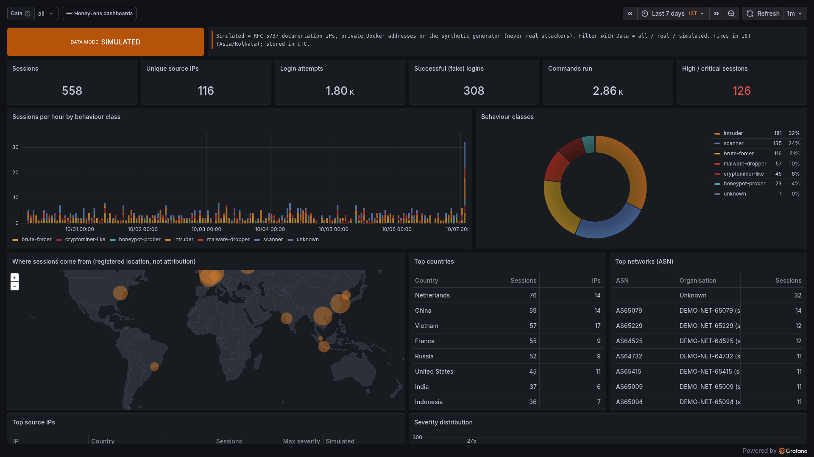
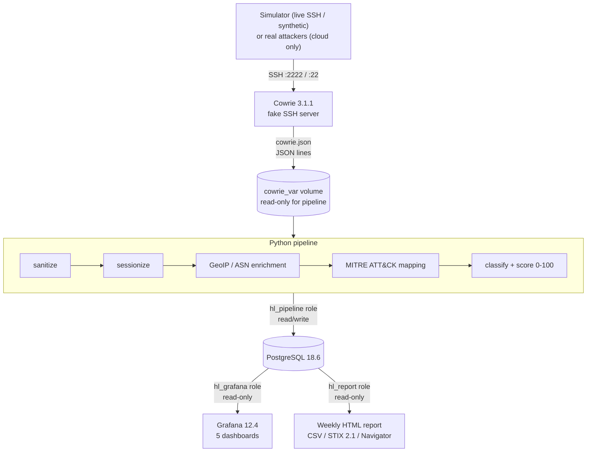

# HoneyLens

[](https://github.com/VRCHAMPION/honeylens/actions/workflows/ci.yml)
[](LICENSE)
[](pyproject.toml)

**An SSH honeypot and threat-intelligence pipeline you can run on a laptop with 3 commands.**

HoneyLens runs [Cowrie](https://github.com/cowrie/cowrie) (a fake SSH server) and reads every attacker
event. It cleans each event, adds location and network information, maps attacker commands to
**MITRE ATT&CK**, scores each session, and stores everything in **PostgreSQL**. You get five
**Grafana** dashboards plus a weekly HTML report with IOC (Indicator of Compromise) exports in CSV,
STIX 2.1 and ATT&CK Navigator formats.



> All dashboard data in the screenshots comes from the built-in simulator, not real attackers.

---

## How to use this repo

### 1. Prerequisites

| Tool | Windows | macOS | Linux |
|---|---|---|---|
| Docker | Docker Desktop (WSL 2 backend) | Docker Desktop | Docker Engine + Compose v2 |
| Python 3.11+ | python.org installer (tick "Add to PATH") | `brew install python` | your package manager |
| Git | git-scm.com | `brew install git` | your package manager |

Check that `docker compose version` prints v2.x. You'll need about 2 GB of free RAM.

### 2. Clone and configure

```bash
git clone https://github.com/VRCHAMPION/honeylens.git
cd honeylens
python scripts/make_env.py          # creates .env with random passwords (git-ignored)
```

### 3. Start the stack

```bash
docker compose up -d --build
docker compose ps                   # wait until postgres, cowrie, pipeline, grafana show (healthy)
python scripts/check_ports.py --live
curl -s http://127.0.0.1:3000/api/health      # Grafana answers on loopback: {"database": "ok", ...}
```

The `migrate` service runs once, creates the database, then exits with code 0. That is expected.
No container has internet access by default (see [Safety](#safety)).

### 4. Generate safe attack data

```bash
docker compose --profile sim run --rm simulator     # 16 real SSH sessions from 8 attacker personas
docker compose --profile sim run --rm synthetic     # 14 days of synthetic events
```

### 5. Open the dashboards

Go to **http://127.0.0.1:3000** and log in as `admin`, using `GF_ADMIN_PASSWORD` from `.env` as
the password. Open **Dashboards**, then the **HoneyLens** folder.

### 6. Attack it yourself

```bash
ssh -p 2222 root@127.0.0.1          # password: admin123
```

Try `uname -a`, `cat /etc/passwd` or `wget http://example.invalid/x`. Your commands appear in
**Session Explorer** within seconds.

### 7. Generate the weekly report

```bash
# Linux/macOS: run as your own user so the files in ./out belong to you
HL_HOST_UID=$(id -u) HL_HOST_GID=$(id -g) docker compose --profile tools run --rm report
# Windows (Docker Desktop):
docker compose --profile tools run --rm report
```

Then open `out/weekly-report.html`. To mask IPs before sharing (source IPs and any IP inside URLs,
commands and session summaries), add `honeylens-report --out /out --mask-ips` to the same command.

### 8. Run the tests

```bash
python -m venv .venv
source .venv/bin/activate           # Windows: .venv\Scripts\activate
pip install -e ".[dev]"
pytest
```

### 9. Stop

```bash
docker compose stop                 # stop, keep data
docker compose down -v              # remove everything, including the database
```

Step-by-step guide with troubleshooting: [RUN_ON_LAPTOP.md](RUN_ON_LAPTOP.md).
To put the honeypot on the internet and catch real attackers: [DEPLOY_CLOUD.md](DEPLOY_CLOUD.md).

---

## Architecture



More diagrams: [docs/ARCHITECTURE.md](docs/ARCHITECTURE.md).

## Features

| Part | What it does | Where |
|---|---|---|
| Cowrie honeypot | fake Debian 12 server, JSON logs, Telnet off, no forwarding, downloads blocked | `cowrie/` |
| Pipeline | tails logs with crash-safe offsets, handles rotation, deduplicates, batches | `src/honeylens/pipeline/` |
| Enrichment | deterministic demo data, optional offline MMDB GeoIP/ASN, database cache, optional rate-limited IPInfo API | `src/honeylens/enrich/` |
| ATT&CK mapping | 60 YAML regex rules across 9 tactics and 45 techniques (ATT&CK v19.2) | `src/honeylens/mitre/` |
| Scoring | explainable 0-100 severity, behaviour classes, bot vs human | `src/honeylens/pipeline/scoring.py` |
| Simulator | 8 safe attacker personas, live SSH plus synthetic mode | `src/honeylens/simulator/` |
| Dashboards | SOC Overview, Credentials & Commands, ATT&CK & Behaviour, Session Explorer, Pipeline Health | `grafana/` |
| Report | weekly HTML report, IP masking, CSV, STIX 2.1, Navigator layer | `src/honeylens/reporting/` |

## By the numbers

| Number | Where it comes from |
|---|---|
| CI: lint, PostgreSQL-backed tests, Docker integration, secret scan | all four jobs run on every push and pull request ([latest runs](https://github.com/VRCHAMPION/honeylens/actions/workflows/ci.yml)); the test job fails below 80% line + branch coverage |
| 373 tests passed, 85.69% coverage | the release commit's [hosted CI run](https://github.com/VRCHAMPION/honeylens/actions/runs/37808655086) (Python 3.12, PostgreSQL 18.6); the count grows as tests are added |
| 5 dashboards | the provisioned Grafana JSON, generated by `scripts/build_dashboards.py`; CI checks every panel returns data |
| 8 simulator personas | source and persona safety tests |
| 60 rules, 9 tactics, 45 techniques | validated against the bundled Enterprise ATT&CK v19.2 snapshot; this is rule coverage, not overall ATT&CK coverage |
| ~5,100-5,900 events/s ingest | `scripts/perf_test.py` on a 2-vCPU ARM64 VM, pipeline and PostgreSQL on the same machine; details in [docs/BENCHMARKS.md](docs/BENCHMARKS.md) |

Trivy's non-gating report lists the HIGH/CRITICAL CVEs in the images; the gate fails the build on any
fixable CRITICAL in the HoneyLens image. No deployed honeypot data was available; every included
sample and screenshot is **SIMULATED**.

## Safety

On a laptop, only `127.0.0.1:2222` (Cowrie) and `127.0.0.1:3000` (Grafana) are published, and CI
checks from the host that both really answer. PostgreSQL has no published port and sits on an
internal network. There's no host networking, no privileged containers and no Docker socket. The
simulator can reach loopback or an exact project service/explicit operator allow-list; unapproved
hostnames are rejected before DNS. **No container has internet access by default:** Cowrie, the
simulator and Grafana are on bridge networks with IP masquerading (outbound NAT) switched off. The
pipeline gets outbound access only if you opt in to IPInfo enrichment with
`docker compose -f docker-compose.yml -f docker-compose.enrich.yml up -d`. In the cloud, host
firewall rules re-applied at boot by a systemd unit also block Cowrie egress.
Fake data uses RFC 5737 documentation IPs and `.invalid` domains. Attacker input is treated as hostile
everywhere, and attacker URLs are never downloaded. See [SECURITY.md](SECURITY.md) and
[docs/THREAT_MODEL.md](docs/THREAT_MODEL.md).

## Limitations

HoneyLens is a low-interaction SSH honeypot and a learning/research pipeline. Its emulated shell is
not a real server. The included events and screenshots are **SIMULATED**; a single deployment sees
only the actors that choose to connect to that address. ATT&CK matches are explainable regex
indicators with false positives and false negatives, severity is a heuristic, and GeoIP describes
network registration rather than a person's identity. Cloud firewall and real-world operation need
verification on the target provider before treating them as production controls.

## Design decisions & what I learned

**Decisions (and where to see them in the code)**

* **Tail Cowrie's JSON log instead of using its database output plugin.** Cowrie, the
  attacker-facing process, never holds database credentials, and HoneyLens controls sanitising and
  replay. The cost is handling rotation, truncation and partial lines itself
  (`src/honeylens/pipeline/tailer.py`, `tests/test_tailer.py`).
* **Effectively-once ingest.** File offsets are written in the same PostgreSQL transaction as the
  events, and each line has a unique hash, so a crash or database outage neither loses nor
  duplicates events (`pipeline/store.py`, integration steps 5-6).
* **Clean at ingest, escape at display.** ANSI escapes, control characters, invisible Unicode format
  characters and oversized strings are removed before storage (`pipeline/sanitize.py`). HTML is
  escaped only when shown (Jinja autoescape plus a strict CSP), so the database keeps the real text.
* **Three least-privilege database roles.** Only `hl_pipeline` can write. `hl_grafana` and
  `hl_report` are read-only through grants *and* `default_transaction_read_only`
  (`db/migrations/003_grants.sql`, `005_default_privileges.sql`, `tests/test_db.py`).
* **Explainable detection over ML.** ATT&CK mapping is 60 YAML regex rules, each with positive and
  negative tests and validated against a bundled ATT&CK snapshot. Severity is a points-based score
  with stated reasons (`mitre/rules.yaml`, `pipeline/scoring.py`).
* **Dashboards as code.** The five Grafana dashboards are generated by
  `scripts/build_dashboards.py`; a test fails if the committed JSON is stale or a query uses an
  unescaped template variable.
* **Default-deny networking and hardened containers.** Non-root users, read-only root filesystems,
  `cap_drop: ALL`, `no-new-privileges`, resource limits, and no outbound NAT unless you opt in.

**What I learned (bugs this project hit and how they were fixed)**

* Docker silently skips published ports for a container attached only to `internal: true`
  networks. The internal-only network looked safest, but it broke `127.0.0.1:3000` and `:2222`.
  The fix was bridges with masquerading off, plus a host-side CI check, because the old
  integration test reached the services over Docker networks and never noticed.
* A log line still being written can be longer than the size limit. Committing the offset in
  the middle of it made the rest look like a new malformed line, so the tailer now remembers that
  it is mid-line.
* `GRANT ... ON ALL TABLES` only covers tables that already exist. Future tables need
  `ALTER DEFAULT PRIVILEGES`.
* Masking "the source IP" is not the same as masking every IP: attacker URLs and commands carry
  addresses too, including defanged ones.

## Roadmap

- **Done:** PostgreSQL-backed suite, Docker integration and secret scan in hosted CI, plus a
  benchmark with retained machine details ([docs/BENCHMARKS.md](docs/BENCHMARKS.md)).
- **Next:** verify the cloud firewall (`deploy/verify-egress.sh`) and the systemd lockdown unit on a
  real VM before exposing Cowrie publicly.
- **Medium term:** broaden rule evaluation with reviewed real-world command examples and add a
  repeatable end-to-end test report.
- **Optional:** support additional sensors or export destinations while preserving least privilege
  and clear simulated-versus-real data labeling.

## Documentation

| File | Contents |
|---|---|
| [RUN_ON_LAPTOP.md](RUN_ON_LAPTOP.md) | full local setup and troubleshooting |
| [DEPLOY_CLOUD.md](DEPLOY_CLOUD.md) | cloud deployment (Oracle Cloud Always Free, AWS alternative) |
| [SECURITY.md](SECURITY.md) | safety rules and how they are enforced |
| [docs/](docs/) | architecture, threat model, data dictionary, ATT&CK coverage, analyst playbook, benchmarks |
| [docs/archive/](docs/archive/) | historical pre-release audit notes |

## Attribution

* MITRE ATT&CK® data © The MITRE Corporation, used under the ATT&CK Terms of Use.
* IP Geolocation by [DB-IP](https://db-ip.com) (CC BY 4.0), if you download the Lite databases.
* Cowrie © Michel Oosterhof and contributors (BSD licence).

Licence: MIT. See [LICENSE](LICENSE).
