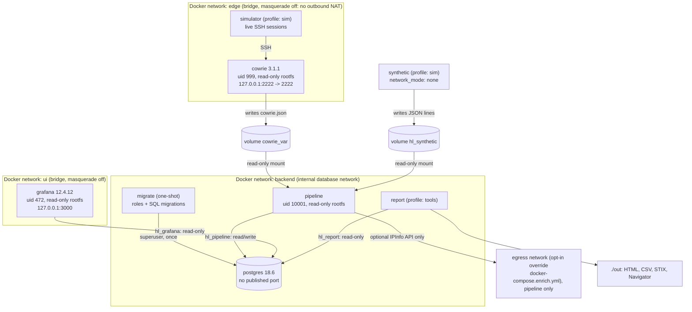
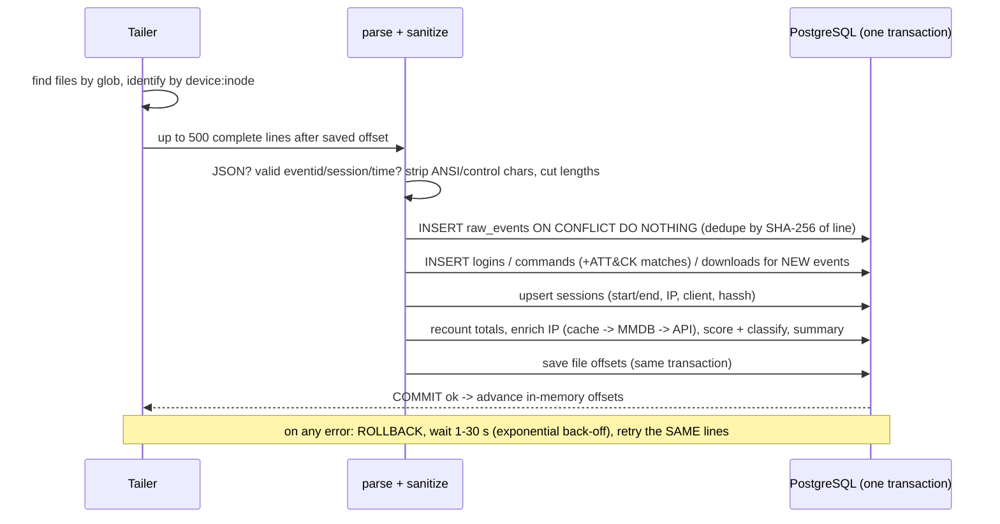
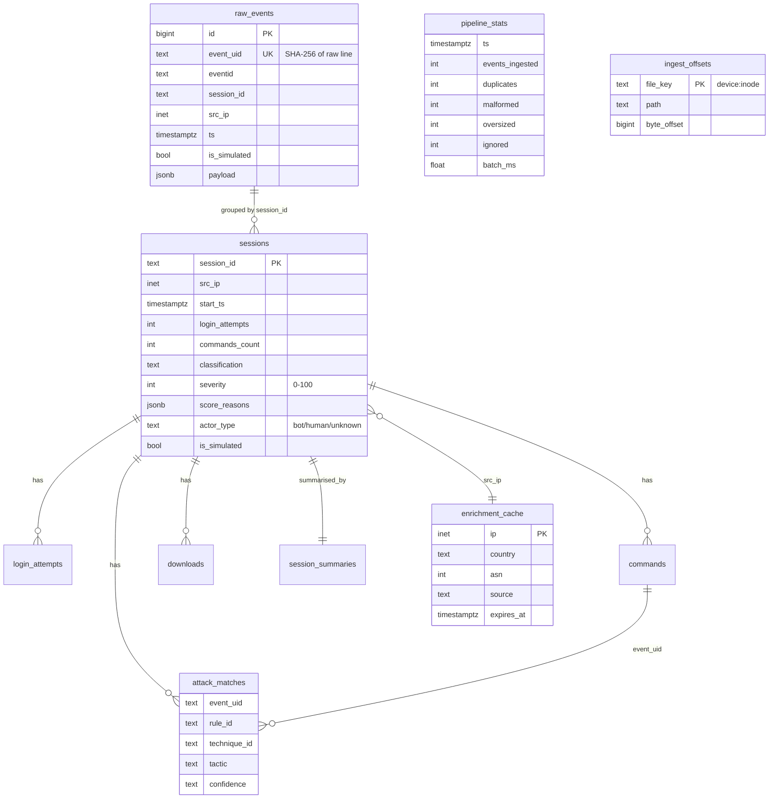
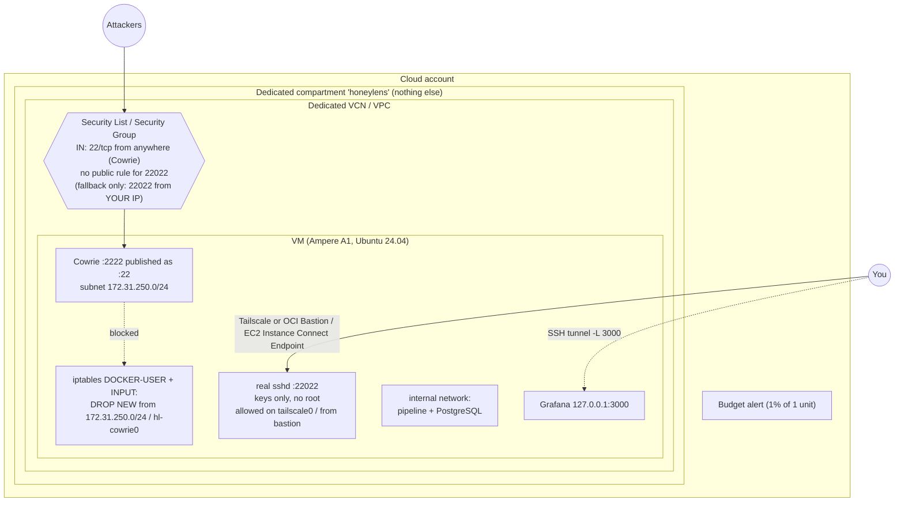

# Architecture

**What:** HoneyLens is a chain of small, separate parts: a fake SSH server writes JSON logs, a Python
pipeline turns them into clean database rows, and two read-only consumers (Grafana and the report)
show them.

**Why this shape:** each part does one job, can be restarted alone, and has only the permissions it
needs. If Grafana is compromised it can only *read*; if the pipeline crashes Cowrie keeps logging and
nothing is lost, because the pipeline resumes from saved offsets.

## 1. Components and data flow

## 2. Inside the pipeline (one batch = one transaction)

| Stage | File | Key idea |
|---|---|---|
| Tail | `pipeline/tailer.py` | inode identity survives rotation; partial lines wait; oversized lines skipped in chunks |
| Parse + sanitize | `pipeline/events.py`, `pipeline/sanitize.py` | whitelist the fields we trust, keep a scrubbed raw copy |
| Store | `pipeline/store.py` | idempotent inserts, sessions rebuilt from child tables (always consistent) |
| Enrich | `enrich/geo.py` | special ranges first, then cache, then local MMDB, then optional API |
| ATT&CK | `mitre/attack.py`, `mitre/rules.yaml` | validated YAML regex rules |
| Score | `pipeline/scoring.py` | points table with reasons; classes; bot-vs-human from timing |
| Loop | `pipeline/runner.py` | batching, back-off, SIGTERM-safe stop, metrics row per batch, heartbeat file, daily retention |

## 3. Database

Full column list: [DATA_DICTIONARY.md](DATA_DICTIONARY.md).

## 4. Cloud isolation (UNVERIFIED - see DEPLOY_CLOUD.md)

## 5. Trade-offs we chose

| Choice | Benefit | Cost |
|---|---|---|
| Tail files instead of Cowrie's PostgreSQL output plugin | Cowrie never gets DB credentials; we control sanitising and replay | must handle rotation/offsets ourselves (tested) |
| Batches of 500 in one transaction | fast, all-or-nothing | a poison batch is retried (malformed lines are filtered before the DB so this is rare) |
| Recount session totals from child tables | always correct even after replays/out-of-order lines | a few more queries per batch |
| Regex rules instead of ML (Machine Learning) | explainable, testable, no training data | misses obfuscated commands; needs rule upkeep |
| Offline MMDB GeoIP | private and free | location ≠ attacker identity; monthly refresh |
| PostgreSQL + Grafana | real SQL skills, familiar SOC tooling | heavier than SQLite (~1.3 GB images) |

## In 30 seconds

HoneyLens is an event pipeline. Cowrie writes JSON, a Python service tails the log with
crash-safe offsets stored in the same Postgres transaction as the data, deduplicates by a hash of
each line, enriches IPs offline, maps commands to ATT&CK with validated regex rules, scores each
session with explainable points, and Grafana plus an HTML report read it through read-only roles.
Everything runs in hardened containers and only loopback ports are exposed on a laptop.
In the laptop Compose stack, Cowrie and the live simulator share the `edge` network and Grafana has
its own `ui` network (plus the internal `backend` network for read-only DB access). `edge` and `ui`
are ordinary bridges, because Docker does not publish ports for a container attached only to
`internal: true` networks, but both have IP masquerading switched off, so there is no outbound NAT
and no working route to the internet. No container has internet access by default. Only with the
opt-in `docker-compose.enrich.yml` override does the pipeline join a normal `egress` network for the
IPInfo provider. The pipeline never shares a network with Cowrie and reads its log volume read-only.
