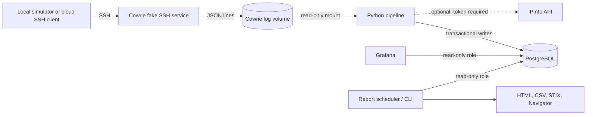

# HoneyLens Project Deep Dive

This guide explains what the repository implements, how its services fit together, and what has
and has not been verified. The screenshots and checked-in sample exports are **SIMULATED** data.
This workspace has no verified real attacker dataset or cloud deployment.

## Executive summary

HoneyLens is a small SSH honeypot and event-analysis system. Cowrie presents a fake Linux server to
SSH clients. HoneyLens reads Cowrie's JSON event log, validates and sanitizes hostile input, groups
events into sessions, adds optional network context, maps commands to MITRE ATT&CK techniques,
calculates explainable scores, and stores the results in PostgreSQL. Grafana dashboards and a
scheduled report make that data easier to review.

It is designed for learning and controlled observation. Cowrie emulates a shell; it does not give
attackers a real Linux machine. Included personas and examples use documentation IP ranges and
reserved domains. A laptop run is private. A public cloud deployment is a separate, **UNVERIFIED**
operation that requires provider-side isolation and firewall checks.

## The problem

SSH honeypots can collect useful evidence about password guessing, commands, and attempted
downloads, but raw logs are awkward to investigate. They need parsing, deduplication, storage,
search, visual summaries, and careful handling because every field can contain attacker-controlled
text. HoneyLens supplies that pipeline and a set of dashboards and exports without claiming to
identify the person behind an IP address.

## Architecture

In laptop Compose mode, Cowrie and the live simulator share the `edge` network and Grafana has its
own `ui` network. Both are bridges with IP masquerading off: published loopback ports work, but there
is no outbound NAT. (An earlier version used `internal: true` here, which made Docker silently skip
the published ports.) The pipeline reads Cowrie's volume rather than sharing Cowrie's network, and it
joins an ordinary `egress` network only with the opt-in `docker-compose.enrich.yml` override for
IPInfo lookups. PostgreSQL is on the separate internal `backend` network. The arrangement is checked
statically by unit tests, and the CI integration job checks from the host that 127.0.0.1:3000 and
127.0.0.1:2222 answer. The cloud Compose override gives Cowrie its own fixed subnet for host firewall rules.

## Complete data flow: one SSH session

1. **Connection.** A client connects to Cowrie. Laptop Compose publishes Cowrie only as
   `127.0.0.1:2222`; the cloud override publishes port 22 and expects the cloud firewall and host
   egress rules described in [DEPLOY_CLOUD.md](../DEPLOY_CLOUD.md).
2. **Emulation.** Cowrie serves its configured fake Debian-like host. It accepts only the five
   exact fake username/password pairs in `cowrie/userdb.txt`; there is no wildcard entry. SSH
   forwarding, tunnels, SFTP uploads, and Telnet are disabled. Cowrie records attempted downloads
   but HoneyLens does not fetch those URLs.
3. **JSON log.** Cowrie writes one JSON object per line to its rotating `cowrie.json` log in a
   named volume. The pipeline mounts that volume read-only.
4. **Tail and resume.** `src/honeylens/pipeline/tailer.py` finds matching files, tracks device/inode identity,
   waits for complete lines, tolerates rotation, and skips oversized lines in bounded chunks. The
   PostgreSQL `ingest_offsets` row stores the byte offset and file identity.
5. **Parse and sanitize.** `src/honeylens/pipeline/events.py` rejects malformed/non-object JSON,
   non-finite JSON numbers, invalid event IDs, session IDs, and timestamps. It normalizes trusted
   typed fields and keeps a depth/size-limited scrubbed raw JSON copy. `pipeline/sanitize.py` removes terminal
   control characters, limits field sizes, and normalizes IPs and ports.
6. **Deduplicate and write atomically.** A SHA-256 hash of the trimmed line bytes is its event identity.
   The pipeline inserts new raw and typed rows with conflict handling, rebuilds the session view,
   and persists new offsets in the same transaction. A failed transaction leaves the previous
   offsets in place so the batch can be retried.
7. **Enrich.** Documentation IPs get deterministic demo values. For other addresses, the pipeline
   checks its database cache, then optional local MMDB files, then an optional IPInfo API provider.
   The API is off unless `HL_ENRICH_API_TOKEN` is set; enabling it sends public source IPs to that
   provider. Calls have a timeout, rate limit, and failure cooldown.
8. **Map and score.** Sanitized command text is matched against reviewed YAML regular expressions
   tied to the bundled Enterprise ATT&CK v19.2 snapshot. Session rules assign a behavioral class,
   a 0–100 score, a severity label, and a list of point-by-point reasons. Command timing can
   suggest bot-like, human-like, or unknown behavior.
9. **Store and explore.** PostgreSQL stores the event, session, login, command, download,
   enrichment, rule-match, summary, metric, and offset data. Grafana queries the database using a
   read-only role; its dashboards show aggregate activity and selected session details.
10. **Report and export.** The read-only report role builds a weekly HTML report and optional CSV,
    STIX 2.1, and ATT&CK Navigator exports. HTML is escaped and self-contained. CSV cells with
    formula-like prefixes are marked safe for spreadsheet display. STIX keeps actual indicator
    values for machine use, labels their source, and is not defanged; use IP masking where needed.

## Technology stack

| Technology | What it is and HoneyLens role | Why used | Alternatives and trade-offs |
|---|---|---|---|
| Python | Application language for parsing, enrichment, scoring, simulator, reports, and CLI tools. | One language spans the ingestion and analysis path; good JSON, PostgreSQL, and security tooling support. | Go or Rust could reduce runtime footprint and improve concurrency, at the cost of more implementation work and less reuse of current Python libraries. |
| Docker | Container runtime for isolated services. | Separates Cowrie, pipeline, PostgreSQL, and Grafana while limiting users, capabilities, filesystems, and resources. | Native processes are simpler to inspect but give weaker deployment isolation; Podman is a compatible alternative with different Compose compatibility. |
| Docker Compose | Local multi-container orchestration and cloud override. | A clone can start a small service graph with named volumes, health checks, resource limits, and network boundaries. | Kubernetes offers orchestration and scaling but adds operational complexity that this single-node project does not need. |
| Cowrie | Low-interaction SSH/Telnet honeypot that emulates a Unix shell and logs interactions. | Provides structured SSH events without exposing a real host shell. | OpenSSH with a disposable VM would be higher interaction and much riskier; other honeypots may focus on different protocols. |
| PostgreSQL | Relational database with JSONB support. | Holds the scrubbed raw event alongside indexed, typed analysis tables and supports SQL dashboards. | SQLite is lighter for a single-user demo but is less suitable for concurrent pipeline and dashboard access; a document database gives up relational queries and grants. |
| Grafana | Dashboard and query UI. | Five provisioned dashboards query PostgreSQL and show health, sessions, credentials, behavior, and ATT&CK matches. | Metabase or a custom web app could provide reports but need separate provisioning or development; Grafana is already common in operations teams. |
| MITRE ATT&CK | Public knowledge base of adversary tactics and techniques. | Provides a shared vocabulary for explaining observed commands. HoneyLens bundles an Enterprise v19.2 snapshot for offline validation. | Sigma or a custom taxonomy could be used; ATT&CK is recognizable but matching a command is only evidence, not proof of intent. |
| GeoIP | Mapping an IP range to approximate registered location. | Adds optional geographic context and a map to dashboards. | No enrichment preserves maximum privacy; external APIs are easier to update but send IPs to a third party. Location does not identify a person. |
| ASN | Autonomous System Number identifying a network that announces an IP prefix. | Adds network owner/provider context alongside location. | RDAP/BGP sources provide richer or fresher data but require more network access and operational upkeep. |
| STIX 2.1 | Structured threat-information exchange format. | Exports indicators and ATT&CK objects for compatible threat-intelligence tools. | CSV is easier to inspect; STIX carries more structure but is more complex and indicators are intentionally not defanged. |
| YAML | Human-readable format for ATT&CK detection rules and configuration. | Detection rules can be reviewed as data with rationale and positive/negative examples. | Python code is more flexible but harder to audit; TOML/JSON have different readability and schema trade-offs. |
| JSON | Cowrie event format and raw event representation. | Cowrie emits one object per line; JSONB stores scrubbed event evidence. | Syslog is widely supported but less structured; protobuf is compact but requires schema tooling. |
| SQL | Query and migration language for PostgreSQL. | Provides explicit schemas, parameterized inserts, views, indexes, roles, and retention. | An ORM could reduce repetitive code but may obscure query behavior; this project uses direct parameterized SQL. |
| pytest | Python test runner and fixture framework. | Covers parsing, hostile input, rule behavior, simulator boundaries, migrations, reports, and Compose checks. | unittest is built in; pytest has a larger plugin ecosystem, including coverage and database markers. |
| Ruff | Python linter and import/style checker. | Fast static checks in local work and CI. | Flake8/isort/pyupgrade cover similar areas as separate tools; Ruff combines them. |
| Bandit | Static checks for common Python security mistakes. | Runs over project Python sources and scripts in CI. | Semgrep offers broader rule customization; static findings still need human review. |
| pip-audit | Checks installed Python dependencies against known vulnerability advisories. | Adds dependency advisory checking in CI. | OSV-Scanner or Dependabot are alternatives; none proves a package is safe or catches unknown flaws. |
| Gitleaks | Secret-pattern scanner over the full Git history in CI, with a generated-token canary check. | Detects likely credentials that ordinary file ignores cannot catch after a commit. | TruffleHog is an alternative; both can have false positives and need history access. The local workspace has no history, but the directory scan and canary checks can run. |
| Hadolint | Dockerfile linter. | Checks Dockerfile construction practices in CI. | BuildKit checks and manual review complement it; lint is not runtime validation. |
| Trivy | Image and dependency vulnerability scanner. | CI reports image HIGH/CRITICAL findings and fails on fixable CRITICAL findings in the project image. | Grype or vendor scanners are alternatives; findings depend on image freshness and vulnerability databases. |
| GitHub Actions | Hosted workflow runner. | Runs pinned lint, test, image, integration, and secret-scan jobs on pushes and pull requests. | Self-hosted CI gives infrastructure control but adds maintenance. |
| ShellCheck | Shell script linter. | CI checks shell scripts for common errors. | Manual shell review remains needed; this executable was unavailable locally. |

## Security architecture

### Isolation and least privilege

- Laptop published ports are intended to be only `127.0.0.1:2222` and `127.0.0.1:3000`. PostgreSQL
  has no host port. The port checker reads the resolved Compose configuration in memory and prints
  only service/port data.
- Containers use non-root users where supported, read-only root filesystems, dropped Linux
  capabilities, `no-new-privileges`, tmpfs for temporary writes, health checks, JSON log rotation,
  and CPU/memory/PID limits. PostgreSQL needs a small set of startup capabilities to set volume
  ownership.
- PostgreSQL grants the pipeline read/write access and grants Grafana and reports SELECT access.
  The read-only roles also set transaction read-only mode and statement timeouts.
- Cowrie configuration disables forwarding, tunnels, SFTP uploads, and Telnet. Its writable logs
  and configuration volumes are constrained. The pipeline mounts evidence read-only.
- Cloud Cowrie uses a fixed bridge subnet, with `DOCKER-USER` and host `INPUT` rules blocking new
  outbound connections. The deployment guide now instructs operators to apply those rules before
  starting the public service. The actual cloud behavior remains **UNVERIFIED** until run on a VM.

### Secrets and hostile input

`.env` contains generated local passwords and is ignored by Git; `.env.example` contains only
placeholders. The release checker rejects other `.env.*` files, private keys, local databases,
logs, archives, GeoIP databases, and known secret values supplied with `--env`. Never publish
actual Cowrie log volumes or reports from a real deployment without review: login tables contain
password strings typed by attackers, and those guesses may be reused elsewhere.

SQL values are passed as bound parameters. Report templates use Jinja autoescaping and an embedded
Content Security Policy with no script or external resources. CSV formula guards protect values
that start with spreadsheet formula characters after spaces/BOM/control whitespace. Parser limits,
control-character removal, line-size caps, bounded regexes, transactional offsets, and database
timeouts reduce hostile-input and resource-exhaustion risks.

### Simulator and outbound privacy

Live simulator targets are limited to loopback, configured Compose service names resolving to
private addresses, or exact operator allow-list entries. An unapproved hostname is rejected before
DNS resolution. The allow-list is powerful: adding a host authorizes a connection, so configure it
only for a system you control. Synthetic mode uses no network. Optional IPInfo enrichment is off
without a token; if enabled, it sends public attacker source IPs to that provider. The pipeline has
no outbound network at all unless the operator also adds the `docker-compose.enrich.yml` override,
which attaches only the pipeline to an `egress` network.

## Detection engineering

`src/honeylens/mitre/rules.yaml` contains 60 rule records: IDs, Python regexes, ATT&CK technique and
tactic, confidence, rationale, and positive/negative command examples. Tests ensure references
exist in the pinned Enterprise ATT&CK v19.2 snapshot, reject revoked/deprecated techniques, and
exercise rule behavior and hostile command timing. Regexes match one sanitized command capped at
4,096 characters. Rules can miss obfuscated commands or match benign strings; confidence records
the strength of the match, not the danger of a session.

The scoring system is deterministic and explainable. It adds bounded points for successful login,
failed logins, commands, distinct tactics, high-confidence techniques, download attempts, and
selected persistence, defense-impairment, resource-hijacking, and data-destruction behavior. The
total is capped at 100 and every contribution is stored as a reason. Labels are low below 25,
medium from 25, high from 50, and critical from 75. Behavior classes use ordered heuristics such as
cryptominer indicators, download behavior, probing, successful login plus commands, and repeated
login failures.

Bot-versus-human is a timing guess, not actor identification. It requires at least three command
timestamps. A median inter-command gap below one second plus a quick first command suggests a bot;
slower, uneven gaps can suggest a human; otherwise the type is unknown. Short scripted actions and
interactive automation can still fool it.

The generated ATT&CK coverage document describes covered techniques within the tactics the
project maps; it is not a claim that HoneyLens detects 8.2% of all threats. The Navigator coverage
layer visualizes the detection rules, while the observed layer visualizes detections from its
source data.

## Database

Migrations `001` through `004` create the schema, views/retention, least-privilege grants, and an
ignored-loopback metric column. The migration runner records versions and checksums; schema files
use idempotent DDL patterns. Times are stored as `TIMESTAMPTZ` in UTC and dashboard/report display
converts to IST.

| Table or view | Purpose |
|---|---|
| `schema_migrations` | Applied migration versions and checksums. |
| `raw_events` | Unique event hash, source metadata, simulated flag, and scrubbed JSONB payload. |
| `sessions` | One reconstructed connection with login/command/download counts, source, enrichment, classification, score and reasons. |
| `login_attempts` | Username, attacker-typed password, result, timestamp and source; treat as sensitive collected data. |
| `commands` | Sanitized command text, whether Cowrie recognized it, and whether a rule matched. |
| `downloads` | URLs and file metadata Cowrie reported; HoneyLens does not fetch the URL. |
| `enrichment_cache` | IP-to-location/network result with source and expiry. |
| `attack_matches` | Event, rule, technique, tactic, confidence, session, and simulated marker. |
| `session_summaries` | Human-readable summary and technique/tactic lists; foreign key to `sessions` with cascade delete. |
| `pipeline_stats` | Batch ingest, duplicate, malformed, oversized, ignored, lag, and timing counters. |
| `ingest_offsets` | File identity, path, byte offset, and reuse-detection hash, committed with events. |
| `v_unmapped_commands`, `v_credentials`, `v_session_overview`, `v_attack_daily` | Read-friendly aggregate and joined views for analysis. |

Indexes support timestamp, session, source, classification, simulated-data, and technique queries.
The only declared table foreign key in the current schema is `session_summaries.session_id` to
`sessions.session_id`; child event tables use event/session identifiers without database foreign
keys, so consistency is primarily enforced by pipeline transactions and tests. Retention deletes
old rows by table-specific timestamps and expired enrichment entries.

## Dashboards

All five dashboards contain SQL queries against PostgreSQL rather than baked sample values. The
checked-in screenshots show simulated data.

1. **SOC Overview:** high-level sessions, source geography, severity, classifications, activity
   trend, top sources, behavior, and pipeline status.
2. **Credentials & Commands:** guessed usernames/passwords, command volume, mapped/unmapped
   commands, and download attempts.
3. **ATT&CK & Behaviour:** matched tactics/techniques, detection rules, behavior classes, and
   timing-derived actor type.
4. **Session Explorer:** searchable session rows, source and score explanations, commands,
   logins, and matched techniques.
5. **Pipeline Health:** heartbeat, ingest rate and counts, duplicates/malformed/oversized/ignored
   lines, lag, batch time, and enrichment statistics.

The shared filters distinguish all, real, and simulated data; timestamps are shown in IST while
stored in UTC. PostgreSQL values populate the panels, and each dashboard has a visible data-mode
indicator.

## Threat reporting and exports

- **HTML:** weekly windows and prior-week comparison, summary tables, session details, ATT&CK
  mapping, defender suggestions, and methodology/limitations. It uses escaped template values,
  embedded CSS, and no external scripts or requests. Reports include attacker-typed password
  guesses and should be handled as sensitive data.
- **CSV:** IOC rows for convenient spreadsheet use. Formula-like untrusted text is prefixed to stay
  inert in spreadsheet software. CSV values are not defanged for machine processing.
- **STIX 2.1:** a bundle of identity, indicators, ATT&CK patterns, and a report object. Indicator
  values remain usable, are labelled as simulated or honeypot-observed, and are low confidence.
  Validate before import; masking omits IP indicators because a masked IP is not a valid pattern.
- **ATT&CK Navigator:** a layer showing observed technique scores or a separate layer showing
  rules the project can detect.
- **Scheduling:** the report scheduler defaults to Monday at 06:00 in `Asia/Kolkata`; its clock
  and schedule logic have unit tests. End-to-end writing through the running Compose service was
  not exercised in this audit.

The report notes that IP registration data is not attribution. If DB-IP Lite is configured, the
required attribution is “IP Geolocation by DB-IP” under CC BY 4.0; other providers have their own
terms.

## Simulator

Synthetic mode writes deterministic Cowrie-shaped events and has no network. Live mode makes SSH
sessions only after the target guard approves the destination. The eight scripts are:

| Persona | Simulated behavior |
|---|---|
| `scanner` | Connects, reads the banner, and leaves. |
| `brute-forcer` | Tries a list of common fake credentials without a successful pair. |
| `recon-bot` | Logs in with a fake pair and gathers OS, user, CPU, process, and network details. |
| `mirai-loader` | Mimics IoT botnet loader commands and reserved test-address downloads. |
| `cryptominer-dropper` | Mimics rival-miner cleanup, fake download, huge-page tuning, and cron persistence. |
| `ssh-key-implant` | Mimics authorized-key and password persistence with an explicitly fake key string. |
| `honeypot-prober` | Checks container/VM indicators and leaves. |
| `log-wiper` | Mimics history/log wiping and credential-file discovery commands. |

These are command strings for Cowrie's emulation, not exploit implementations or malware. Test code
checks every persona for unsafe IPs, live URL domains, EICAR content, and expected event schema.

## Testing and CI

Test modules cover configuration and parser behavior, sanitization, scoring, ATT&CK rules, tailing
and rotation, enrichment, simulator safety, Cowrie fake-user configuration, API rate/timeout limits,
secrets scanning, exports, STIX, Navigator, scheduling, Compose hardening, and PostgreSQL-backed
roles/pipeline/report flows. Database fixtures require `HL_TEST_PG`; Compose tests require Docker.
`scripts/integration_test.py` describes an end-to-end run including outage recovery, restart,
rotation, hostile lines, roles, Grafana, reports, scheduler, and fail-closed secrets. It begins by
running `docker compose down -v` unless `--keep` is used, so it can delete local Docker volumes.

The GitHub workflow pins actions to commit SHAs and scanner images to digests, uses read-only
workflow permissions, and defines separate lint, test (Python 3.11 and 3.12), Compose/integration/
image-scan, and Gitleaks jobs, plus a small job that reads the pinned images from
`docker compose config --images` so CI never scans or tests a different version from the one
Compose runs. It runs on pull requests and on pushes to main. At the re-audit fixes PR the suite
has 415 tests: 393 pass locally against PostgreSQL 18.6, plus 22 that need the Docker CLI and run
in CI, at 86% line + branch coverage (gate: 80%). The Docker job runs the full integration script
([latest runs](https://github.com/VRCHAMPION/honeylens/actions/workflows/ci.yml)). Without `HL_TEST_PG` or Docker, the database and
Compose cases are reported as skipped, so a plain local `pytest` shows lower coverage than CI.

## Performance

`scripts/perf_test.py` measures ingestion into PostgreSQL with generated events and prints machine,
Python, event count, elapsed rate, session rate, and a simple query latency. It creates a uniquely
named temporary database and drops it afterward; the supplied `HL_TEST_PG` account needs create
and drop database rights. Results, with the machine they were measured on, are kept in
[BENCHMARKS.md](BENCHMARKS.md) (about 5,100-5,900 events/s on a 2-vCPU ARM64 VM). An older
"about 6,400 events/second" figure had no retained output and is no longer quoted.

## Limitations

- Cowrie emulates SSH behavior and shell output; it is not a high-interaction host or a safe place
  to execute real attacker payloads.
- A single honeypot sees only traffic that chooses its address and is subject to honeypot bias.
- Screenshots, committed sample reports, and synthetic events are **SIMULATED**, not observed
  attacks. No real session count is verified here.
- Regex ATT&CK matching and heuristic severity can miss behavior or overstate it. Technique
  mapping is not attribution or proof of an actor.
- GeoIP/ASN describe network registration and routing ownership, not a person or group.
- Enabling IPInfo shares public source IP addresses with that third party.
- Cloud firewall rules, the boot-time lockdown unit and cloud billing have not been verified on a
  real VM. Docker routing, migrations, role behavior and the full integration run are covered by
  hosted CI.

## Real-world applications

With a reviewed deployment and explicit data-handling rules, the system could support SOC training,
incident-response exercises, university labs, controlled SSH telemetry research, or monitoring
experiments for an organization that owns the host. An MSSP or product team could use it as a
small-sensor prototype, but a product would need multi-tenant isolation, operator authentication,
retention controls, privacy/legal review, resilient fleet management, and tested cloud controls.

## Future roadmap

- **Immediate:** execute PostgreSQL, Compose, and integration checks in a Docker-enabled environment;
  verify cloud egress rules before opening a public service; capture reproducible benchmark metadata.
- **Medium term:** expand reviewed detection examples, assess database child-row referential
  integrity and retention behavior, and produce a repeatable CI artifact report.
- **Optional/stretch:** add additional sensor protocols or export destinations only with matching
  isolation, privacy, and data-mode controls.

## Interview explanation

### 30 seconds

“HoneyLens is a small SSH honeypot analytics project. Cowrie emulates a fake server, a Python
pipeline validates and enriches its JSON events, PostgreSQL stores them, and Grafana plus weekly
HTML/STIX reports help explain activity. I focused on hostile-input handling, least privilege,
replay-safe ingestion, explainable ATT&CK mapping, and clear separation of simulated data.”

### 60 seconds

“Cowrie records attempted SSH sessions without exposing a real shell. The pipeline tails its
rotating JSON logs, rejects malformed or oversized data, sanitizes typed fields, deduplicates by a
line hash, and commits event rows and file offsets together so restarts can resume safely. It adds
cached/local GeoIP where configured, matches command strings to tested ATT&CK regex rules, and
scores sessions with stored reasons. PostgreSQL roles separate writes from dashboard/report reads.
Five Grafana dashboards and scheduled exports present results, while simulator guardrails and
container/firewall controls reduce the chance of the honeypot being used against third parties.
The committed examples are simulated, and I label runtime and cloud checks that still need CI or
deployment verification.”

### Five-minute walkthrough

1. Show the data path in [ARCHITECTURE.md](ARCHITECTURE.md), then distinguish laptop ports from
   cloud exposure.
2. Inspect a Cowrie event and follow it through strict JSON parsing, sanitization, deduplication,
   a transactional offset, and typed PostgreSQL rows.
3. Open a rule in `src/honeylens/mitre/rules.yaml`: explain its rationale, confidence, ATT&CK
   mapping, and positive/negative tests.
4. Show a session's score reasons and why bot-versus-human remains a timing heuristic.
5. Compare the five dashboards and the HTML/CSV/STIX/Navigator output; explain which values are
   simulated, what the read-only roles permit, and why IOCs are not attribution.
6. Close with evidence: the hosted CI run (PostgreSQL-backed tests above the 80% coverage gate,
   Docker integration, secret scan) and the benchmark with its machine details. Cloud egress
   blocking is the part still to verify on a real VM.

### Difficult questions and answers

**Does an ATT&CK match prove an attacker used that technique?** No. It is a regex match against a
sanitized command with a confidence label. It can be a false positive or miss obfuscated behavior.

**Why keep raw JSON if fields are sanitized?** The scrubbed, size-limited JSON preserves context
for investigation; typed columns are used for trusted analysis. The source Cowrie log remains
hostile and should be protected.

**How do you avoid duplicate events after restart?** The event hash is unique, and log offsets are
committed in the same transaction as event inserts. On failure the transaction rolls back, leaving
the previous offset available for retry.

**Are the screenshots evidence of real attacks?** No. The checked-in samples are marked simulated
and use documentation IPs and reserved domains. Real cloud observations have not been verified in
this workspace.

**What is the most important remaining validation?** Verify cloud egress blocking
(`deploy/verify-egress.sh`, including after a reboot with the systemd unit) on the actual target
provider before exposing Cowrie publicly. The Docker/PostgreSQL suite already runs in hosted CI.

## Verification status

* **Hosted CI (every pull request and every push to main):** ruff, bandit, pip-audit, ShellCheck, hadolint; the
  PostgreSQL-backed pytest suite with an 80% coverage gate; Compose config and port-policy checks,
  Trivy, the full Docker integration test (including host-side checks that 127.0.0.1:3000 and
  127.0.0.1:2222 answer); and a full-history Gitleaks scan with a canary.
* **Measured with retained details:** pipeline throughput ([BENCHMARKS.md](BENCHMARKS.md)).
* **Not yet verified:** cloud deployment, cloud egress blocking and the boot-time lockdown unit on
  a real VM, and any real (non-simulated) attacker data.

The pre-release audit notes are kept, as historical records, in [archive/](archive/).
